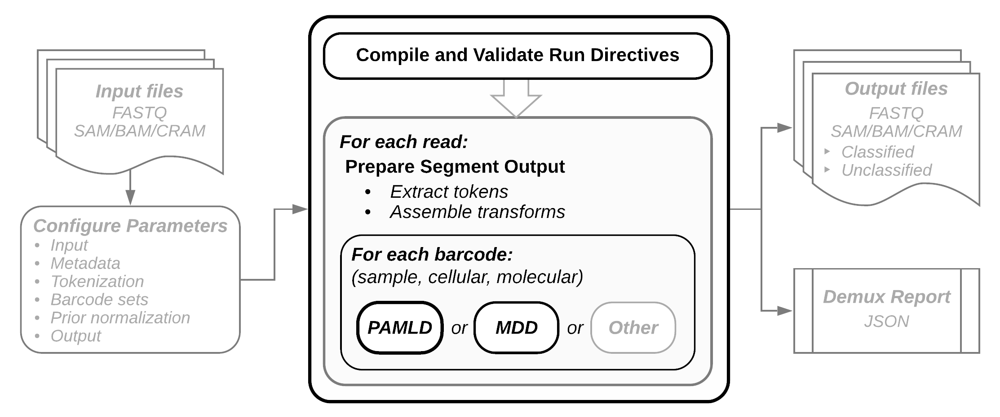

* placeholder
{:toc}

# From overview

The framework of a Pheniqs run includes three main steps: validating run parameters, extracting sequence elements from input sequence reads, and decoding each element according to a set of rules provided in the configuration:

{: .diagram}

The essential components of a Pheniqs workflow are:
+ **Input**: FASTQ or SAM-formatted sequence files.
+ **Configuration**: All runtime directives, including I/O, sequence elements of interest, barcode sets, metadata, and any prior information about sample distributions. Pheniqs can be run with default parameters, but in most cases a configuration file will be required.
+ **Tokenization**: Each read segment is parsed to extract each sequence element to be processed, as specified in the configuration.
+ **Decoding**: For each barcode, Pheniqs will perform either probabilistic decoding (PAMLD, preferred) or simple minimum distance decoding (MDD), as specified in the configuration.
+ **Output**: Biological sequences, observed and inferred barcode sequences, quality scores, and decoding error probabilities are emitted as output. Sequence Alignment/Map (SAM) format is preferred, but FASTQ may also be emitted.
+ **Run Report**: Summary statistics about the decoding run are computed and written in a machine-readable JSON format, which can be easily parsed for visual display.

# Input

Pheniqs is designed to take **sequence** files as input. All standard sequence file formats are accepted. Most commonly, three or four FASTQ files, as emitted by Illumina sequencers, will be used as input. Pheniqs can manipulate both uncompressed and gzip compressed [FASTQ](glossary#fastq), as well as [SAM, BAM and CRAM](glossary#htslib) files.

# Configuration

Pheniqs also needs **configuration** directives in order to execute a decoding run. Required parameters include input / output file names and paths, barcode sets, transform directives for extracting tokens, and a variety of metadata, such as expected proportions of multiplexed sample libraries.

If no user-provided configuration file is available, Pheniqs will run with defaults for all parameters, but in most cases a configuration file will be needed to specify all of the run-specific information. Configuration files are [JSON](https://en.wikipedia.org/wiki/JSON) encoded for easy integration with automated pipelines. A summary of all configuration directives is provided in the [Configuration](configuration) page.

At the beginning of a run, Pheniqs will **compile and validate** the configured parameters and will abort with explicit error messages upon any validation failure.

If **prior estimation** of barcode distributions are planned, a preliminary run will be executed and the configuration will be updated accordingly.

# Tokenization

Due to its flexible syntax for parsing read segments, Pheniqs can accommodate virtually any experimental design. Configuration directives will handle any combination of biological and technical sequences, such as barcoded multiplexed sample libraries, cellular indexes, and UMIs, for both bulk and single-cell experimental designs.

An overview of how Pheniqs parses sequence reads is provided in the [Tokens](tokenization.html) page.

Examples of how to configure tokenization transform patterns for a handful of published experimental designs may be found in the [workflow section](workflow.html) of the documentation.

# Decoding

Pheniqs currently implements two types of decoders to infer barcode sequences to be used for sequence classification:

+ A standard **minimum distance decoder (MDD)** that uses Hamming (edit) distance and simple string matching to allow zero or more errors per barcode, and
+ A **Phred-adjusted maximum likelihood decoder (PAMLD)**, which consults sequence quality scores and prior sample distributions to compute the full posterior probability for observed barcodes. PAMLD implements two successive filters to determine decoding success or failure, a _noise_ filter and a _high confidence_ filter:

{: .img-small}
<!--  -->

Reads with a lower conditional probability than random sequences fail the noise filter and are classified as noise without further consideration. Reads with a posterior probability that does not meet the confidence threshold fail the confidence filter; these reads are classified, but they are marked as "qc fail" so the confidence threshold can be reconsidered at alater stage. A full description of the mathematics behind Pheniqs, as well as performance evaluations and comparisons with other decoding methods, may be found [here]().

Pheniqs is designed to accommodate the addition of alternative decoders, which can be added as derived classes of a generic decoder object.

# Output

Biological sequence read segments are emitted along with observed and corrected barcode sequences and decoding error probability scores for each barcode. All of these may be specified with standard templates and may be overridden by additional directives within the configuration file.

The error score is computed as one minus the confidence score; for compound barcodes, it is one minus the product of the individual confidence scores. An example of the output is provided on the [Tokenization](tokenization.html) page.

# Run Report

Summary statistics for each run are also generated. Run reports are [JSON](https://en.wikipedia.org/wiki/JSON) encoded, which makes them easy to parse and use for producing tabular data and visualizations.

# From background

Pheniqs can be configured to handle any arbitrary configuration of biological and technical sequences such as barcoded libraries, cellular indexes, and UMIs, for both bulk and single-cell experiments. Different types of sequences are extracted using **token** directives, while **transform** directives define rules for barcode extraction, which vary depending on the specific experimental design. See the [workflow](workflow) page for more information on common experimental designs, read anatomy, tokenization, and transform patterns. The [tokenization](tokenization) page provides a high-level view of how transform patterns are constructed and the output they provide. Examples of how to configure Pheniqs for a handful of published experimental designs are provided in the [workflow](workflow) page to help users get started with their own applications.

To configure Pheniqs for any particular workflow, it helps to have some idea about next-gen sequencing technology, Illumina's bcl2fastq softare, common file formats, and some general terminology.

<!-- Right now this is a laundry list that needs to be organized. -->

## Illumina Sequencing

Illumina offers several sequencing platforms for short-read sequencing that have different throughput capacity and somewhat different chemistry.

+ An Introduction to Next-Generation Sequencing Technology [PDF](https://www.illumina.com/documents/products/illumina_sequencing_introduction.pdf)

### Sequence file formats

Pheniqs can accept as input and write as output both FASTQ and SAM/BAM/CRAM sequence formats. In addition, Pheniqs can perform on-the-fly conversion between these sequence formats.

#### FASTQ

+ [FASTQ  format](https://support.illumina.com/content/dam/illumina-support/help/BaseSpaceHelp_v2/Content/Vault/Informatics/Sequencing_Analysis/BS/swSEQ_mBS_FASTQFiles.htm)
+ [FASTQ files explained](https://support.illumina.com/bulletins/2016/04/fastq-files-explained.html)

#### Sequence Alignment/Map (SAM)

+ SAM specification [PDF](https://samtools.github.io/hts-specs/SAMv1.pdf)
+ Auxilliary tags [PDF](https://samtools.github.io/hts-specs/SAMtags.pdf)

### bcl2fastq

bcl2fastq is used to convert raw BCL files produced by Illumina sequencers into FASTQ files for input to Pheniqs.

+ bcl2fastq2 Conversion Software v2.20 [PDF](https://support.illumina.com/content/dam/illumina-support/documents/documentation/software_documentation/bcl2fastq/bcl2fastq2-v2-20-software-guide-15051736-03.pdf)

### Sample Sheets

Metadata about any run is contained in Illumina **sample sheets**. Pheniqs is packaged with [Python helper tools](pyapi.html) to assist users with I/O management. The [IlluminaAPI](illumina_python_api.html) can automatically generate an initial configuration file from any Illumina sample sheet.

+ [More information about Illumina sample sheets]()

Barcode design: To optimize demultiplexing results, choose index adapters that optimize color balance when performing library prep.

### Sample Indexing and Barcode Sets

Sequence libraries are prepared with flanking **adapter sequences** that are used as **barcodes** to classify multiplexed sample libraries.

+ [Indexed Sequencing Overview Guide](https://support.illumina.com/downloads/indexed-sequencing-overview-15057455.html) - [PDF](https://support.illumina.com/content/dam/illumina-support/documents/documentation/system_documentation/miseq/indexed-sequencing-overview-guide-15057455-05.pdf) (updated April 2, 2019)
+ [Illumina Adapter Sequences]](https://support.illumina.com/downloads/illumina-adapter-sequences-document-1000000002694.html) - [PDF](https://support.illumina.com/content/dam/illumina-support/documents/documentation/chemistry_documentation/experiment-design/illumina-adapter-sequences-1000000002694-11.pdf) (updated June 13, 2019)
+ [IDT adapters](https://www.idtdna.com/pages/products/next-generation-sequencing/adapters)
  - Article: Unique, dual-indexed sequencing adapters with UMIs effectively eliminate index cross-talk and significantly improve sensitivity of massively parallel sequencing. MacConaill LE, Burns RT, et al. [ _BMC Genomics_, 19 : 30. (2018) ](https://www.idtdna.com/pages/products/next-generation-sequencing/adapters)

#### Adapter Trimming and UMI Removal

Depending on settings, the bcl2fastq2 Conversion Software can trim adapter sequences from biological sequence reads and remove Unique Molecular Identifier (UMI) bases from reads.

Pheniqs does not currently perform adapter trimming, but this feature may be added in future releases. Thus you may wish to include this step when generating FASTQ files to be used as input to Pheniqs. _**UMI removal by bcl2fastq is not recommended since Pheniqs can extract and preserve all barcodes in SAM format.**_

+ Adapter trimming — The software determines whether a read extends past the DNA insert and into the sequencing adapter. An approximate string matching algorithm identifies all or part of the adapter sequence and treats inserts and deletions (indels) as one mismatch. Base calls matching the adapter sequence and beyond are masked or removed from the FASTQ file.
+ UMI removal — UMIs are random k-mers attached to the genomic DNA (gDNA) before polymerase chain reaction (PCR) amplification. After the UMI is amplified with amplicons, the software can retrieve the bases and include them in the read name in the FASTQ files. When the TrimUMI sample sheet setting is active, the software can also remove the bases from the reads.

## Some Terminology

Based on: https://gatkforums.broadinstitute.org/gatk/discussion/6472/read-groups

In practice, a **read group** refers to a set of reads that were generated from a single run of a sequencing instrument. Read groups are identified in the SAM/BAM/CRAM file by a number of tags that are defined in the official SAM specification.

In the simple case where a single library preparation derived from a single biological sample was run on a single lane of a flowcell, all the reads from that lane run belong to the same read group.

When multiplexing is involved, then each subset of reads originating from a separate library run on the same lane will constitute a separate read group.

Some analysis tools will fail if the read groups are not specified in the BAM file's header section of the BAM file. The following command shows the read group information: `samtools view -H sample.bam | grep @RG`

Additional information about libraries and samples are also specified by specific SAM tags. The basic set of tags associate with read groups are as follows:

#### @RG:ID - Read group identifier
This tag identifies which read group each read belongs to, so each read group's ID must be unique. It is referenced both in the read group definition line in the file header (starting with @RG) and in the RG:Z tag for each read record. In Illumina data, read group IDs are composed using the flowcell + lane name and number, making them a globally unique identifier across all sequencing data in the world.

Note that some tools have the ability to modify IDs when merging SAM files in order to avoid collisions. ID is the lowest denominator that differentiates factors contributing to technical batch effects: therefore, a read group is effectively treated as a separate run of the instrument in data processing steps such as base quality score recalibration, since they are assumed to share the same error model.

#### @RG:PU - Platform Unit
The PU holds three types of information, the {FLOWCELL_BARCODE}.{LANE}.{SAMPLE_BARCODE}. The {FLOWCELL_BARCODE} refers to the unique identifier for a particular flow cell. The {LANE} indicates the lane of the flow cell and the {SAMPLE_BARCODE} is a sample/library-specific identifier.

Note that this field can only be added after demultiplexing.

#### @RG:SM - Sample
The name of the sample sequenced in this read group.
In the case of multiplexing, in which multiple samples are run together in one lane, the SM tag defines the individual sample names.
Otherwise there will be one SM tag per lane.

#### @RG:PL Platform/technology used to produce the read
This constitutes the only way to know what sequencing technology was used to generate the sequencing data. Valid values: ILLUMINA, SOLID, LS454, HELICOS and PACBIO.

#### @RG:LB DNA preparation library identifier
All samples derived from the same library prep should share the same LB tag. The LB field helps determine which read groups might contain molecular duplicates, in case the same DNA library was sequenced on multiple lanes.
The above document illustrates a vignette for a case where samples from three individuals were used to prepare two different libraries that were each run across two lanes of an Illumina HiSeq, generating 3 x 2 x 2 = 12 read groups that are written to 12 BAM files (one read group / lane / BAM file). There is a hierarchical relationship between read groups (unique for each lane) to libraries (sequenced on two lanes) and samples (across four lanes, two lanes for each library). Each read group is assigned a unique ID and carries additional metadata.

>Example: @RG ID:FLOWCELL1.LANE1 PL:Illumina LB:LIB1 SM:SAMPLE1 PI:200
ID: Flowcell#.Lane# (unique per lane)
PL: Illumina (common for all files)
LB: Unique per library (here, shared between 2 lanes each)
SM: Unique per sample; shared between all libraries for each sample (here, 2 libraries x 2 lanes per sample = 4 read groups)
PI: 200 or 400 (fragment lengths)
{: .example}

_Note from GATK documentation_: GATK expects all read groups appearing in the read data to be specified in the file header, and will fail with an error if it does not find that information (whether there is no read group information in the file, or a subset of reads do not have read groups). For BAM files that lack required fields or do not differentiate pertinent factors within the fields, Picard's AddOrReplaceReadGroups can be used to add or appropriately rename the read group fields.
